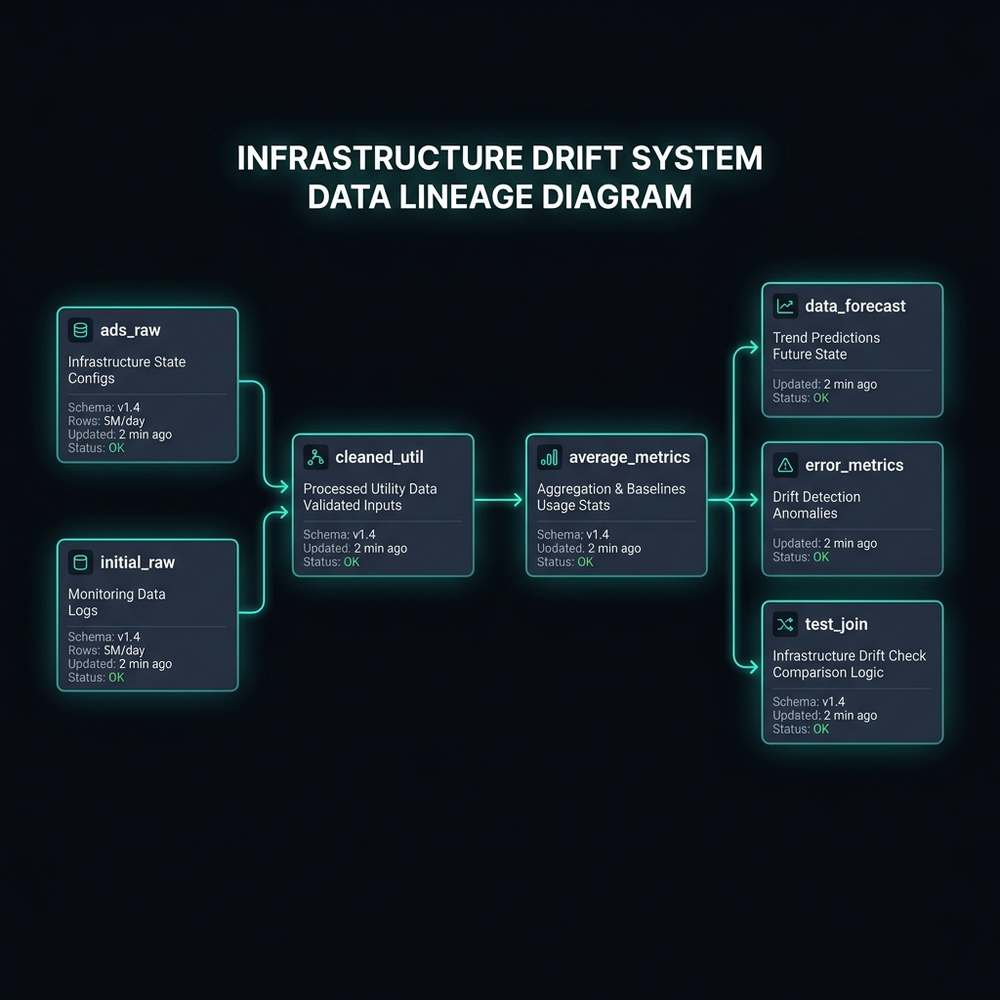

# Infra Drift System 

A robust dbt-based pipeline for tracking infrastructure utilization, forecasting future demand, and detecting metric drift.

## Data Lineage

Below is the automated lineage for the system, showing the flow from raw cluster monitoring data to final drift detection joins.



## Core Components

### 1. Staging (`models/staging/`)
- **`initial_raw_dataset`**: Extracts and cleans raw monitoring logs from BigQuery. Includes complex timestamp conversion logic to handle mixed Unix epoch formats.
- **`cleaned_util`**: Truncates timestamps and filters for high-quality utilization data.

### 2. Metrics & Forecast (`models/metrics/` & `models/forecast/`)
- **`average_metrics`**: Aggregates utilization by minute to create baseline performance stats.
- **`data_forecast`**: Materialized table containing trend predictions for CPU and Memory.

### 3. Accuracy & Joins (`models/accuracy/` & `models/joins/`)
- **`error_metrics`**: Calculates rolling average errors (MAPE, signed error) to detect when the forecast is drifting from reality.
- **`test_join`**: The final integration layer for drift comparison logic.

## Setup & Execution

### Prerequisites
- dbt Core (or dbt-fusion)
- Google Cloud Project with BigQuery enabled

### Running the Pipeline
```bash
# Refresh the entire lineage
dbt run --select initial_raw_dataset+
```

## Governance & Discovery
This project is integrated with **GCP Dataplex** for automated lineage tracing and cross-project data discovery.
